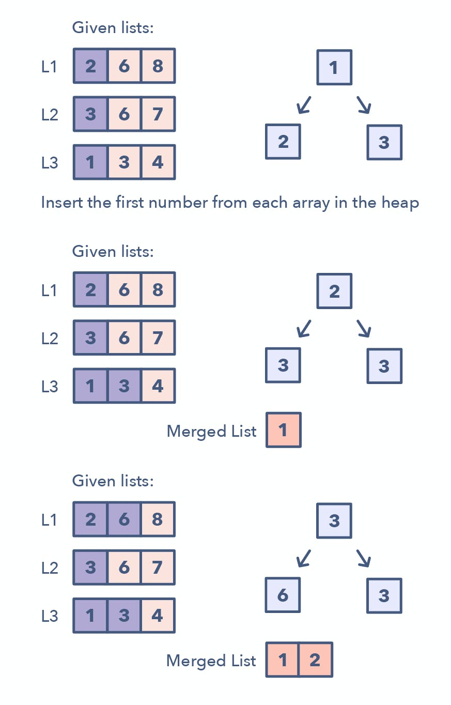

# Pattern 14: K-way merge
K-way Merge helps you solve problems that involve a set of sorted arrays.

Whenever you’re given ‘K’ sorted arrays, you can use a Heap to efficiently perform a sorted traversal of all the elements of all arrays. You can push the smallest element of each array in a Min Heap to get the overall minimum. After getting the overall minimum, push the next element from the same array to the heap. Then, repeat this process to make a sorted traversal of all elements.

The pattern looks like this:

Insert the first element of each array in a Min Heap.
After this, take out the smallest (top) element from the heap and add it to the merged list.
After removing the smallest element from the heap, insert the next element of the same list into the heap.
Repeat steps 2 and 3 to populate the merged list in sorted order.
How to identify the K-way Merge pattern:

The problem will feature sorted arrays, lists, or a matrix
If the problem asks you to merge sorted lists, find the smallest element in a sorted list.

Problems featuring the K-way Merge pattern:

Merge K Sorted Lists (medium)

K Pairs with Largest Sums (Hard)